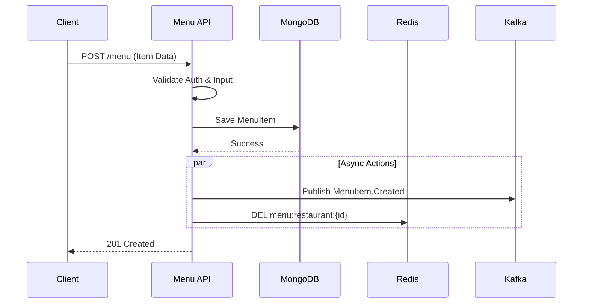
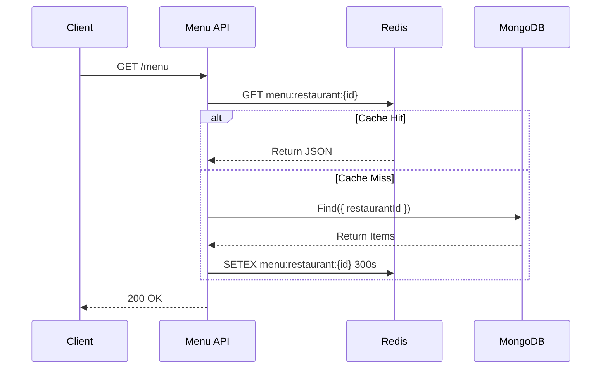

# Menu Service Workflows

This document outlines the core data flows and operational logic of the Menu Service.

## 1. Creating a Menu Item (Write Path)

When a restaurant adds a new item to their menu:

1.  **API Request**: Client sends `POST /v1/restaurants/:id/menu`.
2.  **Validation**:
    *   `auth.middleware`: Verifies JWT and checks if user owns the restaurant.
    *   `menu.controller`: Validates input data (price, title, etc.).
    *   *(Deferred)*: Checks if `foodItemId` exists in FoodItem Service.
3.  **Database Operation**:
    *   Checks for duplicates (same `foodItemId` in this restaurant).
    *   Saves new `MenuItem` to MongoDB.
4.  **Event Publishing**:
    *   Publishes `MenuItem.Created` event to Kafka (`menu-events` topic).
    *   Search Service consumes this to update search indexes.
5.  **Cache Invalidation**:
    *   Clears the cached menu for this restaurant (`menu:restaurant:{id}`).

## 2. Fetching a Menu (Read Path)

When a customer views a restaurant's menu (High Traffic Path):

1.  **API Request**: Client sends `GET /v1/restaurants/:id/menu`.
2.  **Cache Check**:
    *   Service checks Redis for key `menu:restaurant:{id}`.
    *   **Hit**: Returns cached JSON immediately (Fastest).
3.  **Database Fallback (Cache Miss)**:
    *   If not in Redis, queries MongoDB for all items for this `restaurantId`.
    *   Sorts and formats the data.
4.  **Cache Set**:
    *   Saves the result to Redis with a 5-minute TTL (Time To Live).
5.  **Response**: Returns data to client.

## 3. Updating an Item

When a restaurant changes a price or availability:

1.  **API Request**: `PATCH /v1/restaurants/:id/menu/:itemId`.
2.  **Optimistic Locking**: Checks `version` field to prevent overwriting concurrent changes.
3.  **Update**: Modifies the specific fields in MongoDB.
4.  **Event**: Publishes `MenuItem.Updated` or `MenuItem.AvailabilityChanged`.
5.  **Cache**: Invalidates the specific restaurant's menu cache.

## 4. Event-Driven Integration (Async)

The service participates in the broader ecosystem via Kafka:

*   **Outgoing Events**:
    *   `MenuItem.Created/Updated/Deleted`: Consumed by **Search Service** (to index items) and **Reservation Service** (to show pre-order options).
*   **Incoming Events** (Future Implementation):
    *   `FoodItem.Updated`: If the canonical food item changes (e.g., name change), Menu Service updates its local copy.
    *   `Restaurant.Deleted`: If a restaurant is deleted, Menu Service automatically deletes all associated menu items.

## 5. Resilience & Safety

*   **Circuit Breaker**: If Redis fails, the service logs a warning and falls back to direct MongoDB queries (Degraded Mode).
*   **Rate Limiting**: Prevents abuse by limiting requests per IP/User.
*   **Dead Letter Queue**: If an event fails to publish, it's saved to a DLQ for later inspection.
