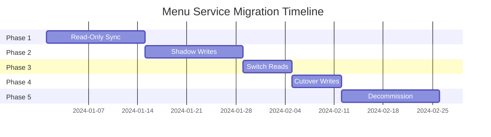

# Menu Service - 5-Phase Migration Plan

## Overview

This document outlines the detailed migration strategy for transferring menu data ownership from Restaurant Service to Menu Service. The migration follows a **5-phase approach** with built-in safety mechanisms, rollback procedures, and validation checkpoints.

## Migration Phases

### Phase 1: Read-Only Sync (Week 1-2)

**Objective**: Deploy Menu Service in read-only mode and establish data synchronization.

#### Steps

1. **Deploy Menu Service**
   - Deploy to staging environment
   - Configure connections to MongoDB, Redis, Kafka
   - Verify health checks and readiness probes

2. **Initial Data Sync**
   ```bash
   npm run migrate -- --mode=initial --env=staging
   ```
   - Run migration script to copy menu data from Restaurant Service
   - Validate data integrity and completeness
   - Compare record counts and checksums

3. **Continuous Sync**
   - Set up periodic sync job (every 15 minutes)
   - Monitor sync lag and errors
   - Alert on discrepancies

4. **Validation**
   - Compare 100% of records
   - Validate foreign key relationships
   - Check data types and constraints

#### Success Criteria
- [ ] Menu Service deployed and healthy
- [ ] 100% data sync completion
- [ ] Zero data discrepancies
- [ ] Sync lag < 5 minutes

#### Rollback
- Simply stop Menu Service
- No impact on production traffic

---

### Phase 2: Shadow Writes (Week 3-4)

**Objective**: Implement dual-write pattern to both services and validate write consistency.

#### Steps

1. **Update Restaurant Service**
   - Add dual-write logic to menu endpoints
   - Write to both Restaurant DB and Menu Service API
   - Log write results for comparison

2. **Deploy Dual-Write**
   ```javascript
   async function createMenuItem(data) {
     const [restaurantResult, menuResult] = await Promise.allSettled([
       restaurantDB.insert(data),
       menuServiceAPI.create(data)
     ]);
     
     // Log for comparison
     logger.info('Dual write results', { restaurantResult, menuResult });
     
     // Return Restaurant Service result (still source of truth)
     return restaurantResult;
   }
   ```

3. **Monitor Discrepancies**
   - Compare write results
   - Track success/failure rates
   - Alert on mismatches

4. **Validation**
   - Run daily reconciliation job
   - Compare data between services
   - Fix any inconsistencies

#### Success Criteria
- [ ] Dual-write success rate > 99.9%
- [ ] Data consistency > 99.99%
- [ ] Write latency increase < 50ms
- [ ] Zero data loss

#### Rollback
- Remove dual-write logic
- Continue using Restaurant Service only
- Menu Service data can be discarded

---

### Phase 3: Switch Reads (Week 5)

**Objective**: Route read traffic to Menu Service using canary deployment.

#### Steps

1. **Deploy Canary**
   - Route 10% of read traffic to Menu Service
   - Monitor error rates, latency, cache hit ratios
   - Gradually increase to 25%, 50%, 75%, 100%

2. **Traffic Routing**
   ```yaml
   # Istio VirtualService
   apiVersion: networking.istio.io/v1beta1
   kind: VirtualService
   metadata:
     name: menu-read-routing
   spec:
     http:
       - match:
           - headers:
               x-canary:
                 exact: "true"
         route:
           - destination:
               host: menu-service
             weight: 100
       - route:
           - destination:
               host: restaurant-service
             weight: 90
           - destination:
               host: menu-service
             weight: 10
   ```

3. **Monitor Metrics**
   - Error rate < 0.1%
   - P95 latency < 200ms
   - Cache hit ratio > 70%
   - Zero data inconsistencies

4. **Gradual Rollout**
   - Day 1: 10% traffic
   - Day 2: 25% traffic
   - Day 3: 50% traffic
   - Day 4: 75% traffic
   - Day 5: 100% traffic

#### Success Criteria
- [ ] Error rate < 0.1%
- [ ] P95 latency < 200ms
- [ ] Cache hit ratio > 70%
- [ ] Zero customer complaints

#### Rollback
- Update traffic routing to 100% Restaurant Service
- Rollback takes < 5 minutes
- No data changes required

---

### Phase 4: Cutover Writes (Week 6)

**Objective**: Route write traffic to Menu Service and make it the source of truth.

#### Steps

1. **Update API Gateway**
   - Route all menu write operations to Menu Service
   - Keep Restaurant Service in read-only mode for 1 week

2. **Stop Dual-Write**
   - Remove dual-write logic from Restaurant Service
   - Menu Service is now the single source of truth

3. **Monitor Closely**
   - Track write success rates
   - Monitor event publishing
   - Validate downstream consumers

4. **Validation**
   - Run end-to-end tests
   - Validate booking flow
   - Check search indexing

#### Success Criteria
- [ ] Write success rate > 99.99%
- [ ] Event publishing success > 99.9%
- [ ] Zero booking failures
- [ ] Search index up-to-date

#### Rollback
- Revert API Gateway routing
- Re-enable dual-write
- Sync data back to Restaurant Service
- Rollback window: 24 hours

---

### Phase 5: Decommission (Week 7+)

**Objective**: Remove menu tables from Restaurant Service and archive old data.

#### Steps

1. **Archive Data**
   ```bash
   mongodump --db restaurant-service --collection menu_items --out /backup/menu-archive
   ```

2. **Drop Tables**
   - Wait 2 weeks after Phase 4
   - Verify no dependencies
   - Drop menu-related tables from Restaurant Service

3. **Update Documentation**
   - Update API documentation
   - Update architecture diagrams
   - Update runbooks

4. **Cleanup**
   - Remove old code
   - Remove dual-write logic
   - Remove migration scripts

#### Success Criteria
- [ ] Data archived successfully
- [ ] Tables dropped
- [ ] Documentation updated
- [ ] Zero incidents for 2 weeks

---

## Safety Mechanisms

### Data Validation

```typescript
async function validateDataConsistency() {
  const restaurantCount = await restaurantDB.count({ collection: 'menu_items' });
  const menuCount = await menuServiceAPI.count();
  
  if (Math.abs(restaurantCount - menuCount) > 10) {
    throw new Error(`Data mismatch: ${restaurantCount} vs ${menuCount}`);
  }
  
  // Sample validation
  const sampleSize = 1000;
  const samples = await restaurantDB.sample(sampleSize);
  
  for (const sample of samples) {
    const menuItem = await menuServiceAPI.get(sample.id);
    if (!deepEqual(sample, menuItem)) {
      logger.error('Data mismatch', { sample, menuItem });
    }
  }
}
```

### Rollback Procedures

Each phase has a defined rollback procedure with maximum rollback time:
- Phase 1-2: < 5 minutes
- Phase 3: < 5 minutes
- Phase 4: < 1 hour
- Phase 5: Not reversible (requires restore from backup)

### Monitoring & Alerts

```yaml
alerts:
  - name: MigrationDataMismatch
    condition: data_consistency < 99.9%
    severity: critical
    
  - name: MigrationHighLatency
    condition: p95_latency > 300ms
    severity: warning
    
  - name: MigrationHighErrorRate
    condition: error_rate > 0.5%
    severity: critical
```

## Communication Plan

### Stakeholders
- Engineering team
- Product team
- Customer support
- DevOps/SRE

### Updates
- Daily standup during migration
- Slack updates after each phase
- Post-mortem after completion

## Risk Mitigation

| Risk | Impact | Probability | Mitigation |
|------|--------|-------------|------------|
| Data loss | High | Low | Dual-write, backups, validation |
| Performance degradation | Medium | Medium | Canary deployment, monitoring |
| Downstream service failures | High | Low | Event replay, circuit breakers |
| Rollback complexity | Medium | Low | Clear procedures, automation |

## Timeline



## Conclusion

This migration plan provides a safe, incremental approach to transferring menu data ownership. Each phase includes validation checkpoints, rollback procedures, and clear success criteria. The entire migration is expected to take 7-8 weeks with minimal risk to production systems.
